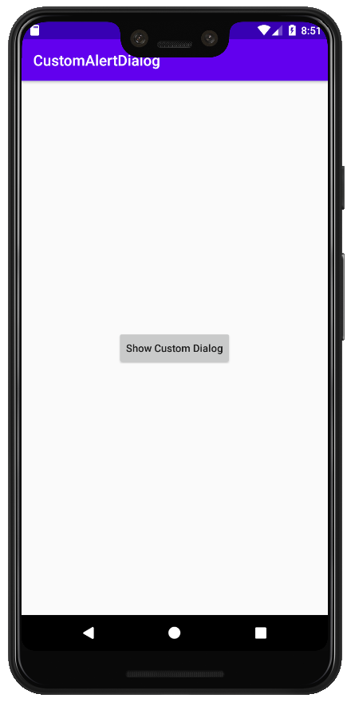
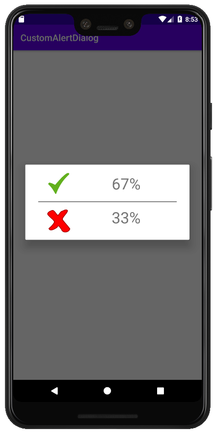
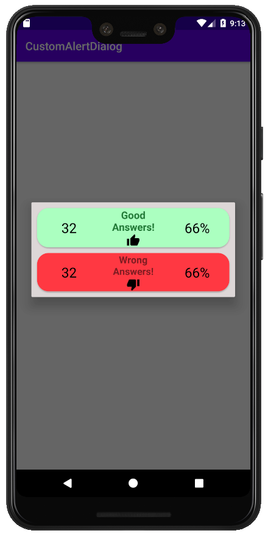

# CustomDialog
Simple Custom Dialog

## General steps:

```
    1- Create a new layout in res/layout folder.
    2- Include images, fonts, colors, etc.
    3- Create a new java class with an alert dialog as a member.
    4- Inflate the custom dialog layout created in step 1.
    5- Define a new member (java class) in your Activity.
```

### A simple custom dialog:

<p align="center">
   
</p>
